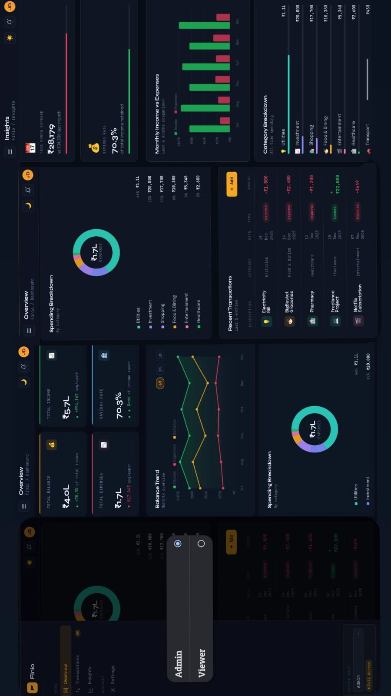

# Finio — Finance Dashboard

A clean, interactive personal finance dashboard built with vanilla HTML/CSS/JS. No frameworks, no build step — just open `index.html` in any browser.

---

## Quick Start

bash
# Option 1: Open directly
open index.html

# Option 2: Serve locally (recommended for full feature support)
npx serve .
# or
python3 -m http.server 8080

---

## Features

### Dashboard Overview
- **4 Summary Cards**: Total Balance, Income, Expenses, Savings Rate — with trend indicators
- **Balance Trend Chart**: Custom canvas line chart with income/expense/balance lines; switchable 6M / 3M / 1M view
- **Spending Donut Chart**: SVG donut with category breakdown and interactive legend
- **Recent Transactions**: Last 5 entries at a glance

### Transactions
- Full paginated transaction table (10 per page)
- **Search** by description or category
- **Filter** by type (income/expense), category, and month
- **Sort** by any column (date, amount, category, type)
- **Export to CSV** — exports currently filtered results
- Admin-only Edit / Delete buttons per row

### Role-Based UI
Switch roles via the sidebar dropdown:

| Feature         | Admin | Viewer |
|----------------|-------|--------|
| View all data  | ✅    | ✅     |
| Add transaction| ✅    | ❌     |
| Edit transaction| ✅   | ❌     |
| Delete transaction| ✅ | ❌     |
| Export CSV     | ✅    | ✅     |

### Insights
- **Top spending category** with percentage bar
- **This month vs last month** expense comparison
- **Savings rate** visualization
- **Monthly bar chart**: Income vs Expenses for last 6 months
- **Category breakdown**: All-time spending by category with proportional bars

### Additional
- **Dark / Light mode** toggle (persisted to localStorage)
- **Data persistence**: Transactions saved to localStorage across sessions
- **Reset to demo data** via Settings page
- **Responsive**: Works on mobile (hamburger sidebar), tablet, and desktop
- **Empty states**: Graceful handling when no data or filters return nothing

---

## Technical Approach

### Architecture
Single-file SPA — all HTML, CSS, and JS in `index.html`. Pages are shown/hidden via CSS classes, simulating a router without any framework overhead.

### State Management
All state lives in module-level variables:

transactions[]  — source of truth for all transaction data
role            — 'admin' | 'viewer'
sortField/Dir   — current sort state
currentPage     — pagination
chartPeriod     — '6m' | '3m' | '1m'

State changes trigger targeted re-renders rather than a full redraw.

### Charts
Both charts (line trend and bar comparison) are drawn directly on HTML5 `<canvas>` using the 2D Context API — no chart library dependency. The donut is pure SVG. All charts respect the current theme.

### Fonts
- **Syne** — display/heading font (geometric, modern)
- **JetBrains Mono** — data, labels, badges (monospaced for number alignment)
- **Epilogue** — body text (refined, readable)

### Design System
CSS custom properties (variables) power the entire theme, making light/dark switching a single attribute toggle on `<html>`.

---

## Demo Data
40 transactions across 6 months (July–December 2025) covering salary, freelance, rent, food, shopping, transport, entertainment, utilities, healthcare, and investment categories.

---

## Project Structure

index.html   — Everything: markup, styles, logic
README.md    — This file

